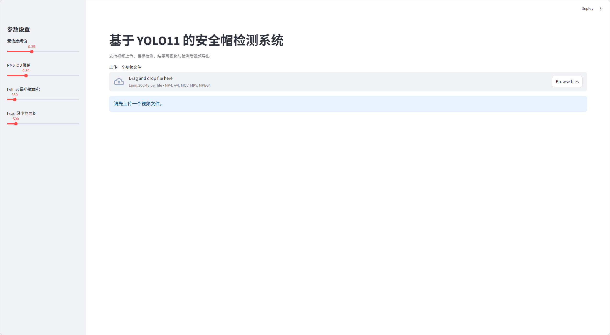
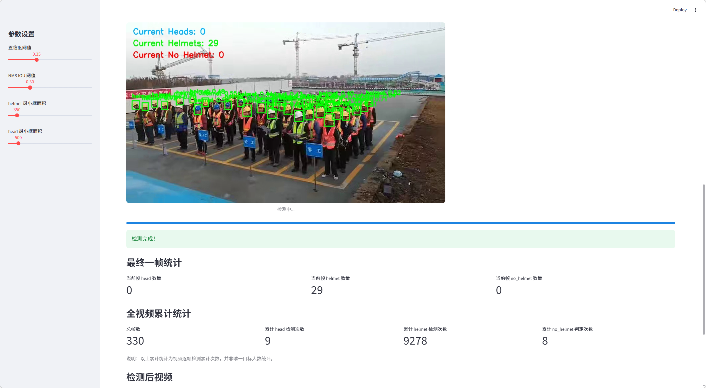
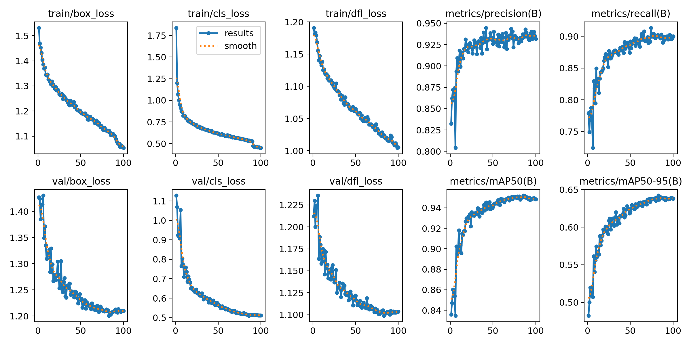
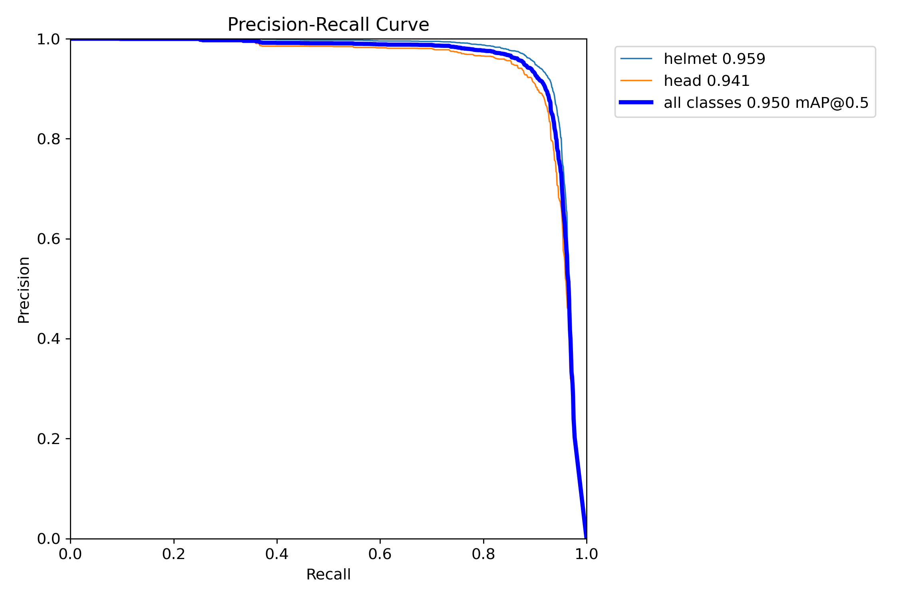
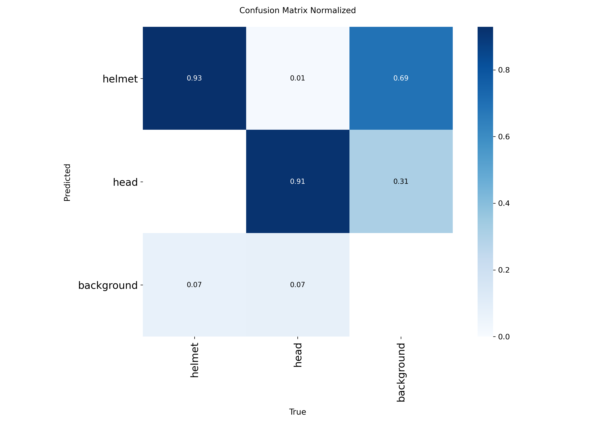

# 基于 YOLO11 的安全帽检测系统

本项目是一个基于 **YOLO11** 的安全帽检测系统，实现了从数据预处理、模型训练到前端展示页面的完整流程，适用于施工场景中的安全帽目标检测与视频演示。

## 项目简介

本项目围绕施工安全场景中的安全帽佩戴检测任务展开，主要完成了以下工作：

- 将 VOC XML 标注格式转换为 YOLO 所需的 txt 格式
- 对数据集进行训练集、验证集和测试集划分
- 使用 YOLO11 进行目标检测模型训练
- 对模型性能进行评估与结果分析
- 基于 Streamlit 构建视频检测展示页面
- 根据 `helmet` 与 `head` 的空间关系，进行简单的未佩戴安全帽判断

本项目不仅完成了目标检测模型训练，还实现了一个可用于演示的视频检测界面，适合课程作业展示与项目汇报。

## 项目特点

- 支持 VOC XML 到 YOLO 标签格式转换
- 支持数据集自动划分
- 基于 YOLO11 完成安全帽检测任务
- 支持视频上传与检测结果展示
- 支持简单的未佩戴安全帽状态推断
- 项目结构清晰，便于复现与二次开发

## 数据集说明

本项目使用的是 Kaggle 上的公开安全帽检测数据集。

原始数据集包含：

- 施工场景图片
- XML 标注文件
- 原始类别包括 `Helmet`、`Head`、`Person`

在本项目中，为了使任务更加聚焦于安全帽检测，我们只保留了以下两个类别：

- `helmet`
- `head`

其中 `person` 类别被去除，以避免任务过于接近通用目标检测，突出本项目在施工安全场景中的应用目标。

> 说明：本项目使用 Kaggle 上的公开安全帽检测数据集。由于数据集体积较大，本仓库不直接提供完整原始数据文件，请先下载数据集后放入对应目录。  
> 数据集下载链接：[[点击这里下载数据集](https://www.kaggle.com/datasets/andrewmvd/hard-hat-detection)]

## 方法流程

### 1. 标注格式转换

原始数据集采用的是 **PASCAL VOC XML** 标注格式，其中每个目标由如下坐标表示：

- `xmin`
- `ymin`
- `xmax`
- `ymax`

为了适配 YOLO11 训练，本项目将其转换为 YOLO 所需格式：
```text
class_id x_center y_center width height
```

其中：

 `x_center`和  `y_center` 表示目标框中心点坐标

 `width` 和  `height` 表示目标框宽高

所有坐标均根据图像宽高进行归一化处理

### 2. 数据集划分

完成标注格式转换后，对数据集进行划分：

训练集（train）

验证集（val）

测试集（test）

用于后续模型训练、验证与测试。

### 3. 模型训练

本项目使用 YOLO11 进行目标检测训练。

训练类别为：

- `helmet`

- `head`

通过训练，使模型能够识别施工场景中的安全帽和头部目标。

### 4. 视频检测展示

本项目使用 Streamlit 搭建了一个前端展示页面，支持以下功能：

上传视频文件

对视频逐帧进行检测

可视化显示 `helmet` 和  `head`

根据空间匹配规则推断  `no_helmet`

因此，本项目不仅完成了模型训练，还实现了一个可交互的视频检测演示系统。

模型训练结果
## 网页展示界面

本项目使用 Streamlit 搭建了一个可交互的网页检测界面，主要支持以下功能：

- 上传视频文件
- 调节检测参数
- 实时展示检测过程
- 输出并下载检测后视频
- 显示当前帧统计与累计检测统计




本项目训练得到的模型在数据集上取得了较好的检测效果。

### 关键指标

| 指标 | 数值 |
|------|------|
| Best epoch | 86 |
| Precision | 0.9338 |
| Recall | 0.9027 |
| mAP@0.5 | 0.9520 |
| mAP@0.5:0.95 | 0.6396 |
### 最优轮次下的损失值

| 损失项 | 数值 |
|--------|------|
| train box loss | 1.1111 |
| train cls loss | 0.5377 |
| train dfl loss | 1.0205 |
| val box loss | 1.2059 |
| val cls loss | 0.5103 |
| val dfl loss | 1.1021 |

从结果可以看出，模型在 `helmet` 和 `head` 两类目标上的检测性能较好，整体训练过程较稳定，具有较好的实用展示价值。

## 训练结果可视化

### 整体训练曲线


### Precision-Recall 曲线


### 归一化混淆矩阵


## 项目结构
```text
.
├── app.py
├── README.md
├── requirements.txt
├── .gitignore
├── assets/
│   ├── results.png
│   ├── BoxPR_curve.png
│   └── confusion_matrix_normalized.png
├── data/
│   └── hardhat.yaml
├── scripts/
│   ├── 01_xml_to_yolo.py
│   ├── 02_split_dataset.py
│   ├── 03_train.py
│   └── 04_predict.py
```
<<<<<<< HEAD
## 环境安装
=======
##环境安装
>>>>>>> 9c566cdbc16f211c1cc01319c40e907887f30e4c

请先安装依赖：
```bash
pip install -r requirements.txt
```
## 使用方法

### 1. XML 标注转换为 YOLO 格式
 ```bash
python scripts/01_xml_to_yolo.py
```
###3. 划分数据集
 ```bash
python scripts/02_split_dataset.py
```
###4. 训练模型
 ```bash
python scripts/03_train.py
```
###5. 运行预测脚本
 ```bash
python scripts/04_predict.py
```
###6. 启动 Streamlit 前端页面
 ```bash
streamlit run app.py
```
前端展示功能

Streamlit 页面支持以下功能：

视频上传

阈值调节

自动检测结果显示

检测后视频生成

简单的未佩戴安全帽推断

该功能使项目更适合课程答辩、课堂展示与结果演示。

注意事项

本仓库不包含完整原始数据集

本仓库不包含训练权重文件，如 best.pt、last.pt

在实际运行前，请先准备数据集并放入对应目录

部分脚本中的路径可能需要根据本地环境自行修改

后续改进方向

后续可以从以下几个方面继续优化：

引入更多真实视频场景数据

对未佩戴安全帽判定方法进行进一步优化

支持实时摄像头检测

优化前端展示界面

导出模型用于部署应用
